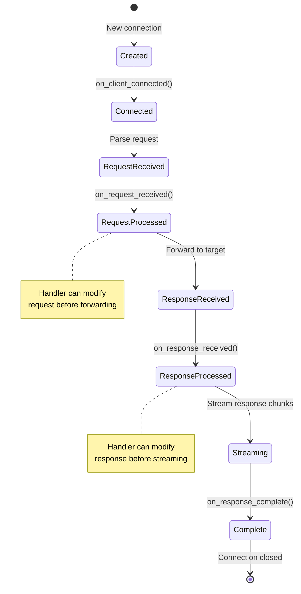
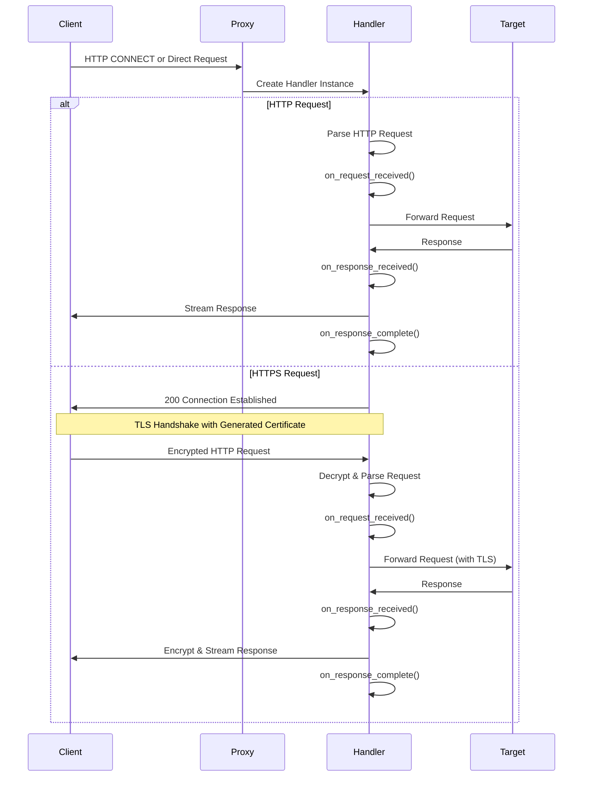
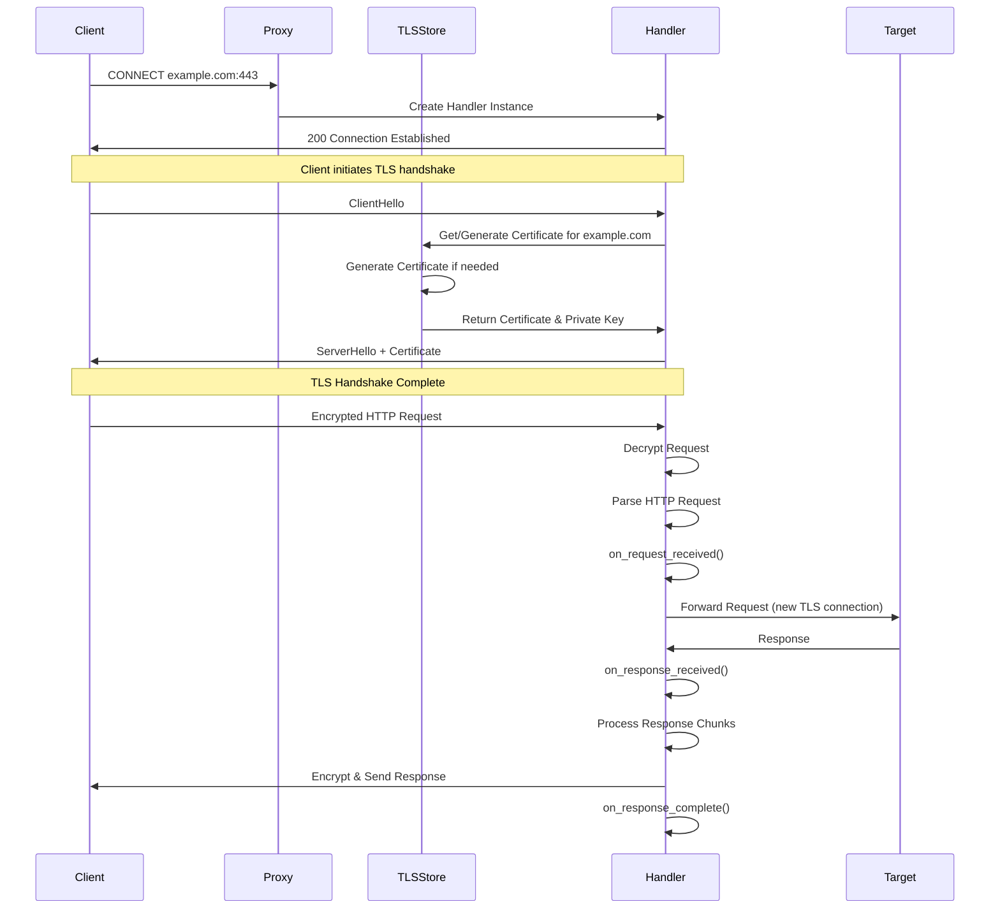
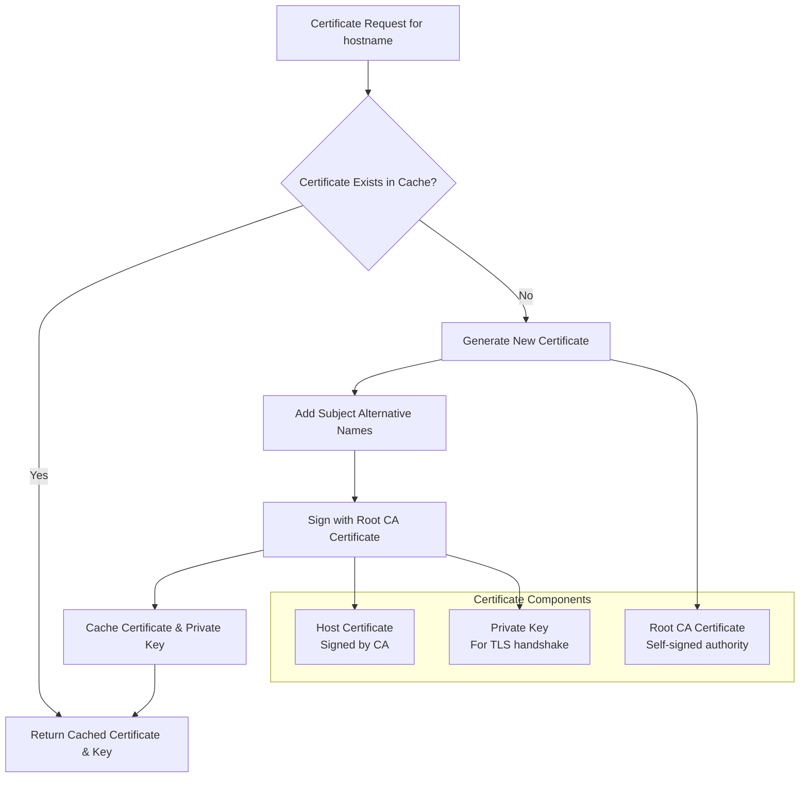

# How It Works

This page explains the internal architecture and flow of the asyncio-https-proxy library, showing how components interact to provide HTTPS interception and request/response handling.

## Architecture Overview

The asyncio-https-proxy library follows a handler-based architecture where each client connection spawns a new handler instance that manages the complete request/response lifecycle.

### Core Components

#### Server Layer
- **`start_proxy_server()`** (`server.py`) - Main entry point for starting the proxy server
- **Connection Handler** (`server.py`) - Manages incoming client connections and creates handler instances

#### Handler Layer  
- **[`HTTPSProxyHandler`](reference/https_proxy_handler.md)** (`https_proxy_handler.py`) - Base class providing lifecycle hooks for customization
- **[`HTTPSForwardProxyHandler`](reference/https_forward_proxy_handler.md)** (`https_forward_proxy_handler.py`) - Ready-to-use implementation for forwarding requests
- **Custom Handlers** - User implementations extending `HTTPSProxyHandler`

#### HTTP Layer
- **[`HTTPRequest`](reference/http_request.md)** (`http_request.py`) - Parses and represents HTTP requests
- **[`HTTPResponse`](reference/http_response.md)** (`http_response.py`) - Handles HTTP response data and streaming
- **[`HTTPHeader`](reference/http_header.md)** (`http_header.py`) - Utilities for HTTP header manipulation

#### TLS Layer
- **[`TLSStore`](reference/tls_store.md)** (`tls_store.py`) - Manages dynamic certificate generation and caching

#### Component Relationships

- **Server** creates new **Handler** instances for each client connection
- **Handlers** use **HTTP components** to parse and manipulate requests/responses  
- **Handlers** interact with **TLS Store** for certificate management during HTTPS interception
- **Custom Handlers** extend the base **HTTPSProxyHandler** to implement specific behavior

## Key Design Principles

### 1. Handler-Based Architecture
Each client connection gets its own handler instance, providing isolation and allowing per-connection customization.

### 2. Asyncio Native
All operations are async/await based, ensuring non-blocking I/O and high concurrency.

### 3. Streaming Support
Both requests and responses are processed as streams, allowing handling of large payloads without memory issues.

### 4. Certificate Management
Dynamic certificate generation enables transparent HTTPS interception without pre-configuration.

### 5. Extensible Design
The base `HTTPSProxyHandler` can be extended for custom behavior, while `HTTPSForwardProxyHandler` provides a ready-to-use forwarding implementation.

## Handler Lifecycle

Each handler instance follows a well-defined lifecycle with extensible hook points:

### Handler Hook Points

The `HTTPSProxyHandler` base class provides several hook methods for customization:

- **`on_client_connected()`**: Called after successful connection establishment
- **`on_request_received()`**: Called after parsing complete HTTP request
- **`on_response_received()`**: Called when response headers are received from target
- **`on_response_complete()`**: Called after complete response has been streamed to client

These hooks enable:
- Request/response logging and analytics
- Content modification and filtering  
- Custom authentication and authorization
- Traffic shaping and rate limiting
- Security scanning and threat detection

## Request Flow

### HTTP Request Flow

### HTTPS Interception Flow

## TLS Certificate Management

The TLS Store manages dynamic certificate generation for HTTPS interception:

The library automatically generates and caches certificates for each unique hostname:

