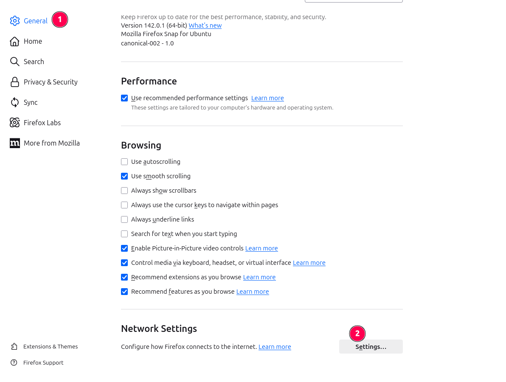
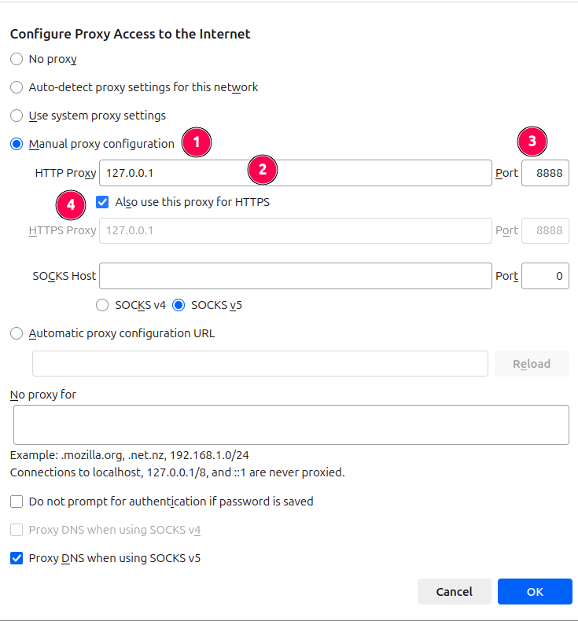
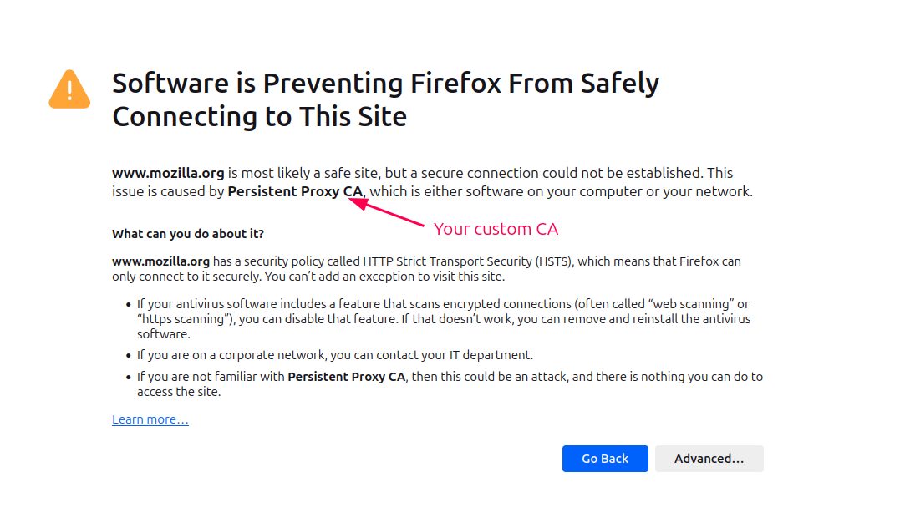
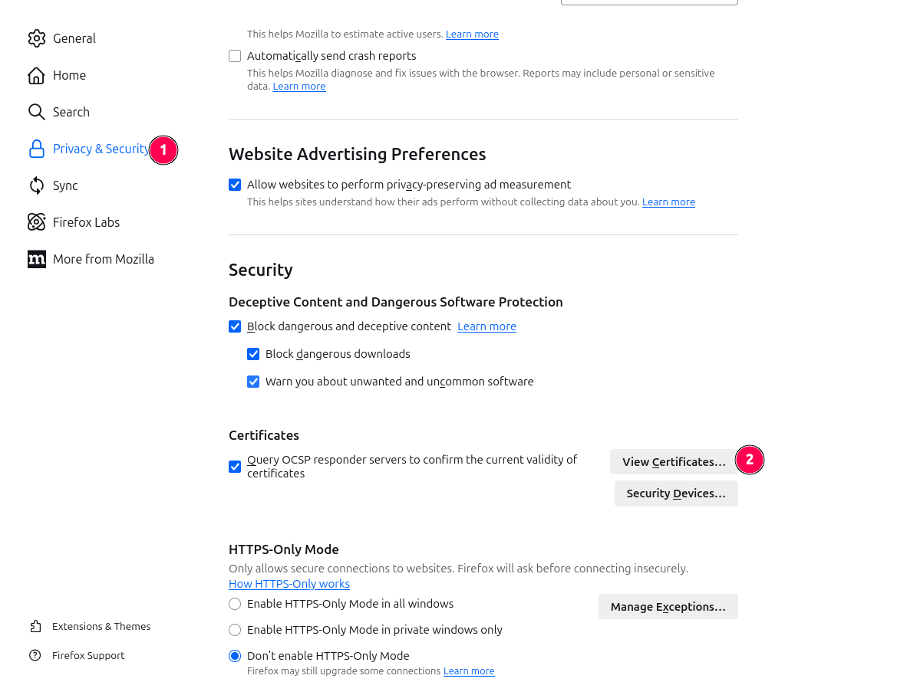
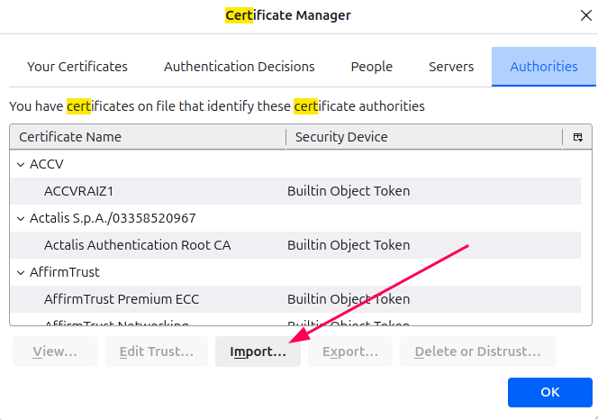
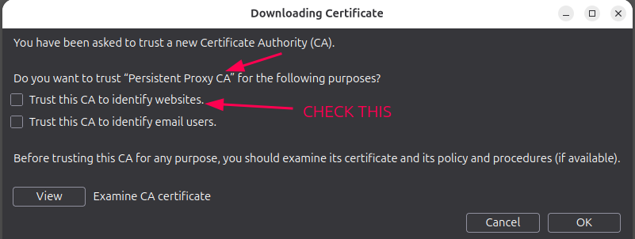

# Firefox Setup for HTTPS Proxy Interception

Firefox is the recommended browser for HTTPS interception because it allows you to create isolated profiles where you can modify SSL certificate and proxy settings. Unlike some browsers that require system-wide changes, Firefox profiles provide better isolation and security.

!!! warning "Security Considerations"
    Firefox supports multiple profiles, and it's strongly recommended to avoid using your main profile for interception as this can create security risks. Always use a dedicated profile for proxy interception.

## Create a Profile

Create a new Firefox profile specifically for proxy interception:

```console
firefox --CreateProfile intercept
```

## Start Firefox with Your Profile

Launch Firefox using the newly created profile:

```console
firefox -P intercept
```

## Setup a Theme (Optional)

!!! tip "Visual Identification"
    It's highly recommended to set up a distinctive theme for your interception browser. This visual distinction helps you easily identify when you're using the proxy-enabled browser versus your regular browser, reducing the risk of accidental exposure.

## Configure the Proxy Settings

Navigate to Firefox settings and configure the proxy:




After configuring the proxy, HTTP sites like http://example.com/ should work normally, but HTTPS pages will display a security error until you trust the CA certificate.

!!! note "Expected Behavior"
    This SSL error is expected and normal until you complete the CA certificate trust setup in the next section.



## Trust the CA Certificate

To enable HTTPS interception, you need to import and trust your root CA public certificate.

!!! danger "Certificate Security"
    Only trust CA certificates that you have generated yourself or that come from trusted sources. Trusting unknown CA certificates can compromise your security and allow malicious actors to intercept your traffic.

1. Access the certificate settings:
   

2. Import the certificate:
   

3. Trust the CA to identify websites:
   

Once the CA certificate is trusted, Firefox will accept the proxy's certificates for HTTPS sites, enabling successful interception.
